# 📊 Project_SQL_Netflix


_Reviewing the NETFLIX catalog of Movies and Series using SQL._

---

## 📝 Project Objective


The objective of this project is to **practice SQL** by working with NETFLIX Movies and Series dataset. The goal is to **clean the data, perform CRUD operations, explore the dataset**, and **extract actionable business insights**.

---

## 🧭 Project Workflow

1. **Database Setup:** Create and populate the SQL database.
2. **CRUD Operations:** Apply Create, Read, Update, Delete operations to manage data.
3. **Data Cleaning:** Ensure data consistency and remove invalid entries.
4. **Exploratory Data Analysis (EDA):** Generate questions and explore the dataset.
5. **Insights Delivery:** Extract and present key business insights.

---

## 📂 Project Files

- **Tool Used:** SQL Server Management Studio (SSMS)
- **SQL Script:** `Analysis Queries.sql` 
- **Dataset Link:** [Movies Dataset](https://www.kaggle.com/datasets/shivamb/netflix-shows?resource=download)
- **Format**: `.csv`
- **Schema**:
```sql
DROP TABLE IF EXISTS netflix;
CREATE TABLE netflix
(
    show_id      VARCHAR(5),
    type         VARCHAR(10),
    title        VARCHAR(250),
    director     VARCHAR(550),
    casts        VARCHAR(1050),
    country      VARCHAR(550),
    date_added   VARCHAR(55),
    release_year INT,
    rating       VARCHAR(15),
    duration     VARCHAR(15),
    listed_in    VARCHAR(250),
    description  VARCHAR(550)
);
```
---

## 🛠️ Database Preparation & Cleaning

### ✅ Setting up the Database

The Netflix dataset was imported into SQL Server Management Studio and formatted using the following operations:
```sql

-- Reviewing the information of the Netflix CSV.

select * from netflix_titles
-- First findings. 
	-- Problem on how the information is order in the Show_id. 
		-- Ex: S1 - S10 - S100 insted of S1 S2 S3
		-- Details information:
			-- show_id is PK and a nvarchar. When casted, the information will order it as a string and not as a INT.
	-- Possible solutions:
		-- Review if changing the type of the column will solve this.

select * from netflix_titles
order by cast(substring(show_id, 2, len(show_id)) as int)
		-- If you cast the column type as INT it dose order it as intended but its not a solution, its a "Temporal" fix for the cast.
		-- Also, i noticed a lot of columns that are not been used.
alter table netflix_titles
	drop column
  column13,
  column14,
  column15,
  column16,
  column17,
  column18,
  column19,
  column20,
  column21,
  column22,
  column23,
  column24,
  column25;
-- The first problematic that we encounter it's HOW the column it's stored. 
-- Because it's an nvarchar, the ordering is doing as intended for the information.
-- The problematic is that the format dosent allow us to order as we want. S1, s2, s3.
-- If the information was stored as s0001, s0002 the ordering function would work.
  -- Brainstorm:
		-- Subcasting as in previous queries and NOT moving the DB.
		-- Add a new column as INT + index.
		-- Adding the missing "Values"
		-- In this case, we will be capping the store capabilities to the max amount. 
	  	-- Not recommended as future addings.
		-- Normalize the schema.
			-- Change the column type.
			-- Removing the S from the ID and change the type to INT.

-- We could replace and alter the table directly, but we can encounter a mistake and lose the information permanently. 
-- Create  a new column and change all the information into it.

alter table netflix_titles add id INT -- Add new column.
select * from netflix_titles -- Validate update.

update netflix_titles -- update ID with previous information 
	set id = cast(substring(show_id, 2, len(show_id)) as int)

-- If we want to make the id as PK and remove the previous Show_id as PK, we need to do a few changes first.
-- If this DB had more tables, we should review the interactions and change the FK and PK to match.
-- We need to set the ID to not null. All PK needs to be not null.
alter table netflix_titles
alter column id int not null;
-- Now we need to change the PK in the column statement.

alter table netflix_titles
	drop column show_id

-- Now the table is order by the ID.
```
## 🔍 Exploratory Data Analysis (EDA)

The goal of this stage is to explore trends and patterns in the dataset that can lead to actionable insights.


1. Task: How many series/movies do we have and which year those have more series/movies released?
```sql
select 
	type,
	release_year,
	count(*) as Total_released,
	rank() over (partition by type order by count(*) desc) as release_rank
from netflix_titles
group by type, release_year
Order by type, release_rank
```
_Result:_ Movies: 2017 with 767. TV Series: 202 with 436. 

What's the top 5 for each type?
```sql
with release_counts as (
	select 
		type,
		release_year,
		count(*) as Total_released
	from netflix_titles
	group by type, release_year
), -- This will create a count for each year and type of release.
ranked as (
	select 
		type,
		release_year,
		Total_released,
		rank() over (partition by type order by Total_released desc) as release_rank
	from release_counts)

-- This will rank the information created in release_counts.
-- Having this CTE will allow us to create a top 5 from each country in the query.
	-- You need to take into consideration that the 2nd query, looks for the information created in the first query. 
	-- In case you want to add more information, it needs to be added in the first query too.
select *
from ranked
where release_rank <= 5
order by type, release_rank

-- The years with the highest movies released are 2017 and 2018.
	-- In this case, we will not create a sub evaluation, its not the main objective.
-- The year with the highest series released is 2020.
```
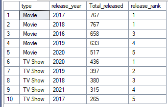

2. Task 2. Identify the most frequently occurring rating for each type of content.
```sql
select 
	type,
	rating,
	count(*) as Title_Count,
	rank() over (partition by type order by count(*) desc) as Ranking -- Creates a rank according to each type, Show or Movie. Then orders it from top to bottom. 
from netflix_titles
group by type, rating
```
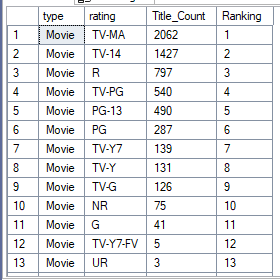

Now using CTEs.
```SQL
with Rank_rating as (
select 
	type,
	rating,
	count(*) as Title_Count 
from netflix_titles
group by type, rating
),
Rank_rating_movie_serie as (
select
	type,
	rating,
	Title_Count,
	rank() over (partition by type order by Title_Count desc) as Ranking -- Creates a rank according to each type, Show or Movie. Then orders it from top to bottom. 
from Rank_rating
)

select *
from Rank_rating_movie_serie
where Ranking <= 5
order by type, Ranking
```
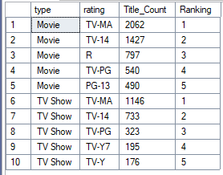

3. Retrieve all movies released in a specific year.
```sql
select *
from netflix_titles
where release_year = '2021' -- Search for an specific year.
order by date_added asc -- Order it by date added.
```
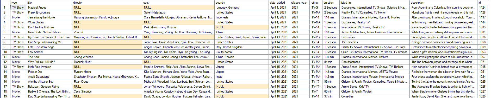

4. Identify the top 5 countries with the highest number of content items.
```sql
select country, count(*) as Count_Countries
  -- Using this format will give us a count of each appearance, but it will count the countries in 2 ways. 
  -- When they appear alone and in addition to another country. To change this, we need to create a windows function to "cut" each iteration from ","
from netflix_titles
group by country
order by 2 desc

-- We need to "Trim" the country column, because there are entries with multiple countries.
-- Once that is done, we need to count each appearance.
-- After that we will rank the appearance of each country.
-- We can do a top or leave it as a list.
```
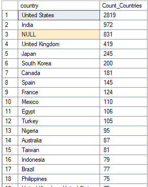

```sql
select 
	top 5 -- This can be removed or changed according to each need.
	trim(value) as country,
	count(*) as Country_Count,
	rank() over (order by count(*) desc) as rank
from netflix_titles
cross apply string_split(country, ',')
where
	country is not null
group by trim(value)
order by rank
```
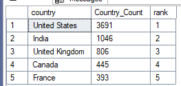

5. Find the movie with the longest duration.
```sql
SELECT 
  title,
  CAST(LEFT(duration, CHARINDEX(' ', duration) - 1) AS INT) AS Duration_new
FROM netflix_titles
WHERE type = 'Movie'
  AND duration LIKE '%min'
ORDER BY Duration_new DESC;

-- The duration its stored as nvarchar, we need to cast it as INT so we can order it.
-- CharIndex finds the position just before ' MIN' so we can use LEFT to remove it.
```
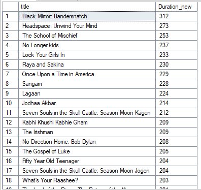

6. Retrieve content added to Netflix in the last 5 years.
7. List all content directed by 'Alfonso Cuaron'.

```sql
select * 
from netflix_titles
where director like 'Alfonso Cuar%'
-- We can not use Cuaron directly as requested because there is a differente simbol.
-- We need to use the function Like to search the closest as we can to the name.

```
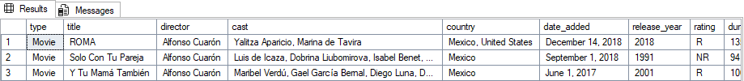

8. Identify TV shows with more than 5 seasons.
```sql
with Review as (
select
	title, duration
from netflix_titles
where type = 'TV Show'
), 
Seasons_Counter as (
select 
	title,
	CAST(LEFT(duration, CHARINDEX(' ', duration) - 1) AS INT) AS Duration_new
from review)

select *
from Seasons_Counter
where Duration_new > 5
order by Duration_new desc
```
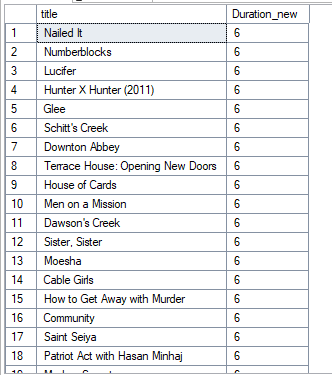

9. Calculate and rank years by the average number of content releases by Mexico.
``` sql
-- We have the same problem as in task 4. We are going to use part of that code to improve our search.

with trim_country as (
select
	id,
	title,
	type,
	release_year,
	trim(value) as Country
from 
	netflix_titles
	cross apply string_split(country,',')
where 
	country is not null 
	and country = 'Mexico'
),
release_stat as (
select 
	release_year,
	count(id) as Release_Count
from trim_country
group by release_year
),
rank_stats as (
select
	release_year,
	Release_count,
	sum(release_count) over() as total_releases,
	rank() over (order by release_count desc) as Release_Rank
from release_stat
)
select
	*
from rank_stats
order by Release_Count desc
```
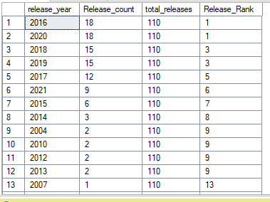

10. Categorize content as 'Bad' if it contains 'kill' or 'violence' and 'Good' otherwise.
```sql
SELECT 
    category,
    COUNT(*) AS content_count
FROM (
    SELECT 
        CASE 
            WHEN description LIKE '%kill%' OR description LIKE '%violence%' THEN 'Bad'
            ELSE 'Good'
        END AS category
    FROM netflix_titles
) AS categorized_content
GROUP BY category;
```
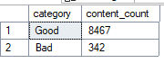


## 🎯 Key Findings

- 💡 **[Insight 1]**: The number of shows vs Movies has been increasing while the movie industry is decreasing from previous numbers.
- 📈 **[Insight 2]**: The closest country to release movies/Tv Shows is India, with less than 2500 releases compared to USA. If you combine the top 5 (excluding USA), you dont even reach the number of releases of USA.
- 🧩 **[Insight 3]**: The longest movie is Black Mirrow with 312 minutes of movie. And the shortest movie is 3 mins long. 

---

## 🧠 Learnings & Challenges

**Learned:**
- How to handle the use CASE to classify information.
- Improved the use of CTEs to prevent long queries.

**Challenges:**
- Using the function cast to prevent ordering information incorrectly.
- Dealing with different formats to evaluate searches.

